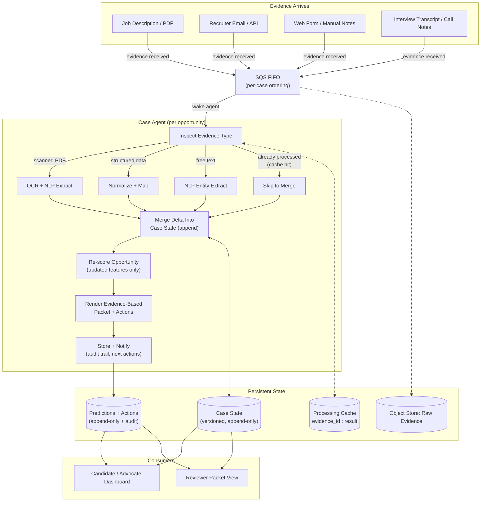

# Advocate-Style Job Search Architecture

## 1. Purpose

Build a local, production-shaped decision-support system for a real job search that behaves like a disability case platform in how it ingests evidence, evaluates sufficiency, surfaces gaps, and produces structured, evidence-based packets.

The system is not a chatbot. It is a case engine.

Each target company is treated as a long-lived case. Evidence arrives over time. Every new artifact re-evaluates the case. The platform continuously updates:

- the current case state
- confidence in key conclusions
- recommended next actions
- structured packet outputs for the candidate and an external reviewer

The product goal is to feel operationally similar to [Advocate](https://www.joinadvocate.com/): guided intake, evidence collection, clear status, strong case building, and human-legible outputs. The domain, however, remains your real job search.

## 2. Product Intent

The system should mimic disability-advocacy verbiage and operating principles while mapping them onto job search work:

- "claimant" becomes the candidate
- "case" becomes a target company or role pursuit
- "medical evidence" becomes job-search evidence such as resumes, job descriptions, recruiter emails, interview notes, portfolio links, referrals, compensation signals, and rejection or offer documents
- "advocate" becomes the system plus the human operator using it
- "government reviewer" becomes an external hiring reviewer, recruiter, hiring manager, or future you evaluating whether the case is strong enough to advance

The tone of the product should be:

- evidence-first
- procedural
- calm and legible
- honest about uncertainty
- optimized for strong case preparation rather than passive note storage

## 3. Non-Goals

- Fully autonomous job applications
- Hidden reasoning that cannot be audited
- Prompt-only workflows that bypass structured state
- A generic CRM or spreadsheet replacement
- Real-time chat as the core abstraction
- Any design that lets LLM output directly become truth

## 4. Core Product Principles

### 4.1 All intelligence flows through versioned state

Every interpretation, recommendation, packet, and score must derive from a versioned case state.

In practice, that means every case state version is created by an immutable evaluation run that records:

- what evidence and derived inputs were in scope
- what functions and rules ran
- what models and prompts were used
- what outputs were attached to that version

### 4.2 Evidence is append-only

Raw evidence is immutable, durable, and replayable.

### 4.3 The platform supports decisions, not automatic actions

It can recommend outreach, follow-up timing, narrative revisions, or risk flags. It should not silently apply, email, or alter records.

### 4.4 Deterministic logic owns compliance-grade behavior

Staleness rules, evidence sufficiency, contradiction detection, action generation, and core scoring stay rule-based and versioned.

### 4.5 LLM usage is bounded and inspectable

LLMs extract structure, summarize evidence, and rank candidate actions, but they never mutate state without deterministic validation.

## 5. Product Experience to Mimic

Advocate’s public product positioning centers on a guided intake, evidence gathering, case preparation, ongoing case management, and support through later stages. This architecture mirrors that shape for job search cases:

1. Free evaluation becomes opportunity intake.
2. Outreach and intake becomes guided case setup for a company and role.
3. Onboarding and submission becomes packet assembly and application readiness.
4. Case management becomes ongoing follow-up, interview tracking, and evidence refresh.
5. Responses, appeals, and next steps becomes objection handling, re-engagement, post-interview follow-up, rejection analysis, and offer-response support.

## 6. High-Level Architecture

| Layer | Responsibility |
| --- | --- |
| Ingestion Service | Accept evidence, store it durably, emit ordered case events |
| Processing Layer | Run Prefect flows that inspect, extract, merge, score, and render |
| State Layer | Maintain append-only evidence, artifacts, and case state versions |
| Retrieval Layer | Hybrid search across role criteria, outreach templates, and evidence |
| Document Layer | Render packet-style outputs with citations |
| Evaluation Layer | Replay external scenarios and assert case outcomes |
| UI | Guided intake, timeline, case health, recommendations, and packet review |

This separation is required. The UI must not perform interpretation. The DAG must remain stateless. Persistent truth must live in storage, not memory.

## 7. Domain Model

### 7.1 CandidateProfile

Represents you as the underlying claimant analogue.

Fields:

- `candidate_id`
- immutable identity metadata
- resume variants
- work history
- skills inventory
- target compensation preferences
- location and work-mode constraints
- high-level search strategy preferences

### 7.2 Case

A case represents one active opportunity pursuit.

In practice:

- one company
- one role family
- optionally one requisition

Fields:

- `case_id`
- `candidate_id`
- `company_name`
- `role_title`
- `job_posting_url`
- `created_at`
- `status`
- immutable case metadata

A case never mutates directly. New interpretations create new `CaseStateVersion` records.

### 7.3 EvidenceItem

Evidence is the atomic input to the system.

Examples:

- job description PDF
- recruiter email
- LinkedIn message export
- interview notes
- call transcript
- portfolio sample
- screenshot of compensation details
- rejection email
- offer letter
- calendar invite

Fields:

- `evidence_id`
- `case_id`
- `source`
- `mime_type`
- `received_at`
- `content_hash`
- `raw_blob_uri`
- `submitted_by`

Properties:

- append-only
- durably stored before processing
- independently replayable

### 7.4 Artifact

Artifacts are derived outputs from processing tasks.

Examples:

- OCR text
- extraction JSON
- entity tables
- embedding vectors
- feature vectors
- rendered packet markdown
- rendered PDF
- outreach draft
- timeline summary

Fields:

- `artifact_id`
- `artifact_type`
- `case_id`
- `input_hashes`
- `producer`
- `producer_version`
- `created_at`
- `blob_uri`

Artifacts are never overwritten.

### 7.5 CaseStateVersion

This is the only trusted operational view of a case.

Fields:

- `case_id`
- `version_number`
- `parent_version`
- `derived_components`
- `completion_metrics`
- `stage_label`
- `risk_flags`
- `prediction_outputs`
- `recommended_actions`
- `created_at`

Everything user-facing reads from `CaseStateVersion`.

`CaseStateVersion` is the truth snapshot, not the full audit log. The full audit log is the evaluation manifest associated with that version.

### 7.6 Evaluation Manifest

Every `CaseStateVersion` must have exactly one associated evaluation manifest.

The evaluation manifest records:

- the triggering evidence
- the parent case version
- the flow run that created it
- the application build or git SHA
- the requirements and state-machine versions
- the producers, model versions, and prompt versions used
- the outputs that were attached to that case version

This is what makes the system auditable and measurable.

## 8. Case State Machine

### 8.1 Philosophy

The state machine evaluates evidence sufficiency, not a rigid workflow checklist.

For every case, the system must answer:

- what do we know
- what is missing
- what is stale
- what is contradictory
- what is likely to matter most to the reviewer

Implementation contracts for the state machine live in:

- [specs/evidence_taxonomy.md](/Users/dacks/repos/advocate/specs/evidence_taxonomy.md)
- [specs/observations.md](/Users/dacks/repos/advocate/specs/observations.md)
- [specs/state_machine.md](/Users/dacks/repos/advocate/specs/state_machine.md)

### 8.2 Required Components

Define required components declaratively in [case_requirements.yaml](/Users/dacks/repos/advocate/case_requirements.yaml).

Example:

```yaml
components:
  identity:
    resume_aligned:
      required: true
    portfolio_or_work_samples:
      required: false
  opportunity:
    target_role:
      required: true
    job_description:
      required: true
    decision_maker_or_recruiter:
      required: false
  relevance:
    top_matching_experience:
      required: true
    quantified_impact_examples:
      required: true
    gap_explanations:
      required: false
  engagement:
    application_submitted:
      required: false
    follow_up_contact:
      required: false
      stale_after_days: 10
    interview_feedback:
      required: false
      stale_after_days: 7
  decision:
    outcome_signal:
      required: false
    compensation_signal:
      required: false
```

Each component stores:

- `present`
- `confidence`
- `evidence_ids`
- `last_updated`
- `stale_after`
- `contradiction_status`

### 8.3 Completion Metrics

The system computes:

- `completion_ratio`
- `missing_components`
- `stale_components`
- `invalid_components`
- `contradicted_components`
- `review_readiness_score`

These are deterministic and reproducible.

### 8.4 Stage Labels

Stages are derived views, not control logic.

Example labels:

- intake
- preparing
- submitted
- interviewing
- waiting
- negotiating
- closed

## 9. Ingestion Layer

### 9.1 Responsibilities

The ingestion service must:

- accept text, files, images, and metadata
- validate request shape
- store raw blobs durably
- create an `EvidenceItem`
- emit an ordered event for downstream processing
- return quickly with `evidence_id`

It must not:

- run OCR
- call LLMs
- merge state
- score cases

### 9.2 Input Sources

Supported sources:

- drag-and-drop file upload
- plain text paste
- browser extension clipping
- email forwarding
- manual structured form entry
- transcript import
- calendar event import
- API ingestion from external tools

### 9.3 Event Backbone

Use an ordered queue per case, such as SQS FIFO semantics or an equivalent local queue that preserves per-case ordering.

Each event:

- names the case
- identifies the evidence
- carries no derived conclusions

## 10. Processing Layer

### 10.1 Orchestration

Use Prefect as the job orchestrator.

Each new evidence arrival triggers `process_case_event(case_id, evidence_id)`.

Flows are stateless. All durable truth is externalized.

### 10.2 Core Flow

1. Acquire a per-case advisory lock.
2. Load the latest `CaseStateVersion`.
3. Inspect evidence type and cache eligibility.
4. Produce missing derived artifacts.
5. Open an evaluation manifest for this run.
6. Merge extracted deltas into a new case state version.
7. Recompute component sufficiency and staleness.
8. Re-score the case using transparent rules.
9. Generate next best actions.
10. Render updated packet artifacts.
11. Attach outputs to the evaluation manifest.
12. Persist outputs and notify the UI.

### 10.3 Correctness Requirements

Correctness depends on:

- per-case serialization
- idempotent tasks
- append-only writes
- explicit retries
- immutable task versions
- immutable evaluation manifests

Race conditions are defects.

## 11. Evidence Inspection and Extraction

### 11.1 Evidence Inspection

The inspect step classifies evidence into:

- scanned document
- structured record
- free text
- image
- transcript
- duplicate or cache hit

This task is deterministic.

### 11.2 OCR and Parsing

OCR runs only when needed. Structured inputs skip OCR and go through normalization. Every OCR artifact records:

- OCR engine version
- confidence
- page-level metadata
- extraction warnings

### 11.3 Bounded LLM Extraction

LLMs are used only for bounded analysis such as:

- extracting companies, roles, dates, compensation numbers, interview steps, and named contacts
- mapping work-history evidence to requirement categories
- turning free-form notes into schema-valid observations
- drafting evidence-grounded summaries

Rules:

- strict JSON schema
- no direct state mutation
- prompt version recorded
- model version recorded
- invalid JSON treated as task failure

LLM output is evidence-linked input, not truth.

## 12. Merge Logic and Truth Maintenance

### 12.1 Merge Principles

- deterministic
- append-only
- evidence-linked
- no silent overwrite
- conflict-aware

Every successful merge creates a new `CaseStateVersion`.

### 12.2 Contradictions

The system must detect contradictions such as:

- two different compensation numbers
- conflicting recruiter names
- changed interview outcomes
- application status inconsistency
- role mismatch between job post and outreach materials

Contradictions are surfaced, not hidden.

### 12.3 Confidence

Final confidence is computed from:

- extraction confidence
- source reliability
- evidence recency
- cross-evidence agreement
- deterministic validation coverage

LLMs do not assign final confidence.

## 13. Prediction and Scoring

### 13.1 Purpose

Scoring is not "will I get hired" magic. It is a transparent case-strength and readiness estimate that helps prioritize work.

### 13.2 Inputs

Scores are computed from:

- case completeness
- alignment between resume and job description
- presence of quantified evidence
- existence of warm-intro or recruiter signal
- recency of activity
- number and severity of contradiction flags
- interview progression evidence
- compensation or urgency signals

### 13.3 Outputs

The scoring system emits:

- `case_strength_score`
- `readiness_score`
- `engagement_score`
- `risk_score`
- `feature_vector`
- `scoring_version`

All scoring logic is versioned and inspectable.

## 14. Hybrid Retrieval

This is a core differentiator. The system should not rely on naïve RAG.

### 14.1 Retrieval Targets

Hybrid retrieval should match a case against:

- job requirements extracted from the posting
- your work-history achievements
- prior outreach examples
- resume bullets and portfolio evidence
- objection-handling snippets
- interview preparation notes

### 14.2 Retrieval Methods

Use a combination of:

- semantic vector search
- keyword and phrase matching
- structured feature filters
- custom weighting for recency, role similarity, company similarity, and quantified impact

### 14.3 Retrieval Outputs

The retrieval layer must return structured evidence bundles, not just passages:

- matched criteria
- why they matched
- confidence and rank
- supporting evidence ids
- missing or weakly supported criteria

## 15. Next Best Action

### 15.1 Deterministic Candidate Generation

Rules generate action candidates from:

- missing components
- stale components
- contradictions
- timing windows
- case stage
- upcoming deadlines or interviews

Actions include:

- tailor resume to missing requirement cluster
- send recruiter follow-up
- create achievement evidence for an uncovered criterion
- request referral
- prepare interview story packet
- reconcile conflicting compensation data
- archive or close a dead case

### 15.2 LLM Role

LLMs may:

- rank already-generated actions
- draft suggested outreach copy
- produce alternative phrasings for case narratives

LLMs may not:

- invent action categories
- suppress mandatory rule-generated actions
- mutate case state

## 16. Packet and Document Generation

The platform should behave like a case-building system, not a feed reader.

### 16.1 Packet Types

Generate structured packet artifacts such as:

- application packet
- recruiter follow-up packet
- interview brief
- role-fit justification memo
- objection-response memo
- post-rejection learning summary
- offer evaluation packet

### 16.2 Packet Requirements

Every packet must be:

- evidence-based
- citation-backed
- reproducible
- rendered from versioned state

Packets should clearly separate:

- objective evidence
- inferred conclusions
- open questions
- recommended next steps

## 17. Storage Architecture

### 17.1 Recommended Local Stack

- Postgres for relational state
- object storage such as local S3-compatible storage for raw evidence and artifacts
- pgvector or equivalent for embeddings
- Redis only for ephemeral coordination or cache, never as truth

### 17.2 Primary Tables

- `candidates`
- `cases`
- `evidence_items`
- `artifacts`
- `case_state_versions`
- `case_evaluation_runs`
- `evaluation_run_inputs`
- `evaluation_run_producers`
- `component_observations`
- `prediction_runs`
- `recommended_actions`
- `processing_runs`
- `evaluation_run_outputs`
- `audit_events`

## 18. UI Requirements

The UI is an observability and operations surface, not the source of truth.

### 18.1 Primary Views

Case Timeline:

- evidence arrivals
- derived artifacts
- state transitions
- scores over time
- interview and outreach events

State Panel:

- completion ratio
- missing and stale components
- contradictions
- readiness and risk scores
- current stage

Packet Panel:

- latest rendered packet artifacts
- evidence citations
- export actions

NBA Panel:

- recommended action
- rationale
- suggested copy
- blocked-by and depends-on context

### 18.2 Intake Experience

To stay close to Advocate’s product shape, the top of the product should emphasize:

- quick evaluation
- guided intake
- low-friction evidence upload
- visible progress through the case
- ongoing support language rather than dashboard jargon

## 19. Evaluation Layer

### 19.1 External Scenario Isolation

Scenarios must live outside the main application codebase.

The scenario contract and intended coverage are defined in [specs/scenario_vision.md](/Users/dacks/repos/advocate/specs/scenario_vision.md).

They are never exposed to:

- prompts
- application logic
- retrieval corpora

### 19.2 Scenario Contents

Each scenario defines:

- candidate profile
- case metadata
- evidence arrival sequence
- expected component states
- score bounds
- expected stage labels
- expected next best actions
- expected packet contents or citations

### 19.3 Scenario Runner

The runner:

1. boots the system
2. replays evidence in sequence
3. waits for flow completion
4. loads the resulting `CaseStateVersion`
5. validates expected outputs

Failures must be explicit and debuggable.

## 20. Operational Characteristics

The system should be designed to expose real operational pain:

- long-running DAGs
- OCR failures
- LLM flakiness
- backfill complexity
- cache invalidation issues
- retrieval regressions
- packet-quality regressions

Those are necessary to harden the architecture into something production-shaped.

## 21. Security and Auditability

Even as a personal system, design as if evidence is sensitive.

Requirements:

- immutable audit events
- artifact provenance
- model and prompt version tracking
- signed or checksummed artifact references
- role-based access if expanded to multi-user

Auditability rule:

- you must be able to reconstruct any case version by following its evaluation manifest, its inputs, and its outputs without relying on implicit application state

## 22. Recommended End-to-End Flow



## 22a. Async Strategy

All I/O in this system is async end-to-end. This section defines the canonical patterns. Coding agents must not mix sync and async patterns.

**FastAPI routes** must be `async def`. Database access uses SQLAlchemy's `AsyncSession` via `create_async_engine` with the `asyncpg` driver. Never import or use the synchronous `Session` class in application code.

**SQLAlchemy** is used in async mode exclusively. All repository functions accept an `AsyncSession` argument and use `await session.execute(...)`. ORM relationships are loaded with `selectinload` or `joinedload` — never via lazy loading, which does not work in async context.

**Prefect flows and tasks** use the `@flow` and `@task` decorators from `prefect`. For CPU-bound work such as OCR, use `task` with `task_runner=ThreadPoolTaskRunner()`. For I/O-bound work such as LLM API calls and database writes, use `async def` tasks directly.

**Advisory locks** for per-case serialization are acquired via raw SQL inside a `AsyncSession` transaction:
```sql
SELECT pg_try_advisory_xact_lock(hashtext(:case_id))
```
The lock is held for the duration of the transaction and released automatically on commit or rollback.

**Prefect flow dispatch** from the ingestion API uses `flow.run_async(...)` or enqueues a message to an in-process queue that the worker polls. Do not use FastAPI `BackgroundTasks` for durable processing — these do not survive process restarts.

**Redis** is used only for ephemeral coordination such as distributed locks or short-lived cache. It is never the source of truth for any case state.

## 23. Ground-Truth Invariant

If the system ever allows recommendations, packets, or UI conclusions to bypass versioned case state, the architecture is wrong.

If the system ever allows a case version to exist without a corresponding evaluation manifest, the architecture is incomplete.
