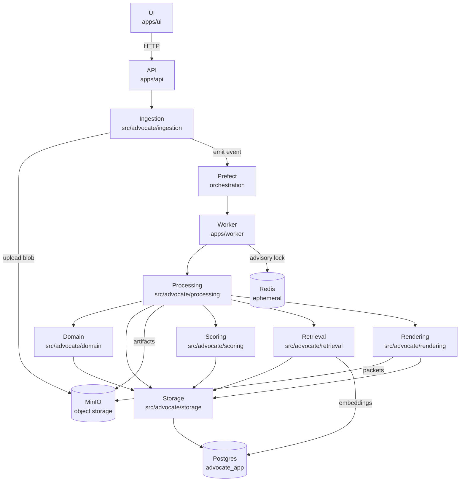
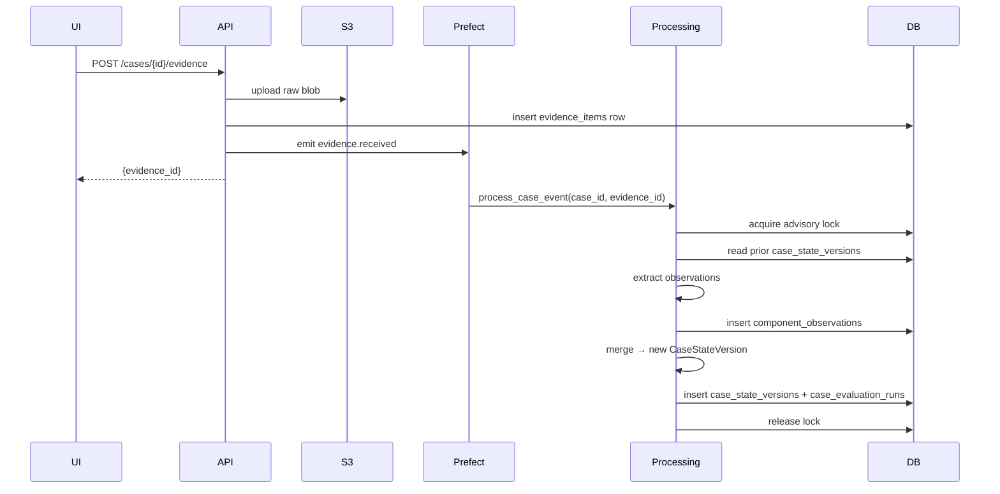

# Architecture Diagram

## 1. Purpose

This is the living architecture diagram for the repo.

It has two jobs:

1. show the system architecture at subsystem level
2. track what each phase has actually built

After every completed phase, update the phase log below.

## 2. Maintenance Rule

Rules:

- keep the system diagram at subsystem level — no individual files
- update the phase log when a phase completes: mark status, add a divergence note if needed
- update the data flow diagram if a new subsystem is added or a flow changes direction

Status markers in phase log:

- `planned` — not yet started
- `built` — implemented and passing tests
- `changed` — built, but with a materially different shape than planned

## 3. System Diagram

## 4. Data Flow: Evidence → Case State

## 5. Phase Log

| Phase | Name | Status | Key files |
|-------|------|--------|-----------|
| 0 | Repo Bootstrap | **built** | `pyproject.toml`, `docker-compose.yml`, `.env.example`, `Makefile`, `alembic.ini`, `src/advocate/config.py`, `infra/migrations/env.py`, `infra/migrations/versions/0001_create_all_tables.py`, `apps/api/main.py`, `apps/worker/main.py`, `tests/conftest.py` |
| 1 | Core Data Layer | **built** | `src/advocate/domain/__init__.py`, `src/advocate/domain/models.py`, `src/advocate/storage/db.py`, `src/advocate/storage/orm.py`, `src/advocate/storage/repositories.py`, `src/advocate/storage/audit.py`, `infra/migrations/versions/0002_add_immutable_table_guards.py`, `tests/unit/test_domain_models.py`, `tests/integration/test_repositories_core.py`, `tests/integration/test_immutable_tables.py` |
| 2 | Ingestion Service | **built** | `src/advocate/ingestion/__init__.py`, `src/advocate/ingestion/router.py`, `src/advocate/ingestion/storage.py`, `src/advocate/ingestion/hashing.py`, `src/advocate/ingestion/events.py`, `src/advocate/processing/flows.py`, `apps/api/main.py`, `apps/worker/main.py`, `tests/conftest.py`, `tests/unit/test_ingestion_hashing.py`, `tests/unit/test_ingestion_validation.py`, `tests/unit/test_ingestion_events.py`, `tests/integration/test_ingestion_api.py` |
| 3 | Processing Flow | planned | `src/advocate/processing/flows.py`, `src/advocate/processing/locks.py`, `src/advocate/processing/inspect.py`, `src/advocate/processing/manifest.py` |
| 4 | Merge And Case State | planned | `src/advocate/domain/requirements.py`, `src/advocate/domain/observations.py`, `src/advocate/processing/merge.py`, `src/advocate/processing/state_machine.py`, `src/advocate/processing/contradictions.py`, `src/advocate/processing/actions.py` |
| 5 | OCR And Extraction | planned | `src/advocate/processing/ocr.py`, `src/advocate/processing/normalize.py`, `src/advocate/processing/extract.py`, `src/advocate/processing/llm_contracts.py` |
| 6 | Scoring And Retrieval | planned | `src/advocate/scoring/scoring.py`, `src/advocate/scoring/actions.py`, `src/advocate/retrieval/chunking.py`, `src/advocate/retrieval/index.py`, `src/advocate/retrieval/search.py` |
| 7 | Packet Rendering | planned | `src/advocate/rendering/packets.py`, `src/advocate/rendering/citations.py`, `src/advocate/rendering/templates.py` |
| 8 | UI | planned | `apps/ui/` |
| 9 | Evaluation Harness | planned | `src/advocate/evaluation/scenario_contract.py`, `src/advocate/evaluation/scenario_runner.py` |

## 6. Phase 0 Notes

- `configs/settings.toml` dropped — config loads from env via pydantic-settings
- Postgres on host port **5433** (local Postgres occupies 5432)
- Prefect **v3** (v2 server conflicted with pip-installed v3 client)
- App DB is `advocate_app`; Prefect uses `advocate` to avoid `alembic_version` collision
- `dev-up` auto-creates `advocate_app`

## 7. Phase 1 Notes

- Phase 1 built on top of the existing Phase 0 schema instead of recreating core tables
- `infra/migrations/versions/0002_add_immutable_table_guards.py` adds database-level append-only guards for immutable tables
- `infra/migrations/env.py` now exposes ORM metadata for autogenerate support while remaining safe to import in tests
- pytest async loop scope now defaults to `function` so async database fixtures clean up reliably

## 8. Phase 2 Notes

- `POST /cases/{case_id}/evidence` now accepts exactly one of an uploaded file or pasted `text_content`
- raw evidence bytes are hashed with SHA-256, stored in MinIO/S3, then persisted as append-only `evidence_items`
- `GET /cases/{case_id}/timeline` and `GET /cases/{case_id}/state/latest` now read directly from the Phase 1 repository layer
- ingestion emits a real Prefect deployment-backed flow run through `process-case-event/ingestion`
- `src/advocate/processing/flows.py` is still a Phase 2 stub; advisory locks, manifests, and `processing_runs` remain Phase 3 work
- `src/advocate/storage/db.py` uses `NullPool` when `APP_ENV=test` so API integration tests can safely create async sessions across function-scoped event loops
