# Architecture Diagram

## 1. Purpose

This is the living file-level architecture diagram for the repo.

It has two jobs:

1. show the target architecture in terms of concrete file paths
2. show what each phase has actually built

After every completed phase, update this document so it reflects the real repository, not the intended repository.

## 2. Maintenance Rule

This document is part of the deliverable for every phase.

Rules:

- change the status of files from `[planned]` to `[built]` when they exist and are in use
- add new files that were created during the phase
- remove or mark replaced files if the implementation changed direction
- keep the diagrams aligned with actual repo paths
- add a short phase note whenever the implementation diverges from the planned file map

Status markers:

- `[planned]`: expected but not yet built
- `[built]`: implemented and in use
- `[changed]`: built, but with a materially different role than first planned

## 3. Full System File Map

```mermaid
graph TD
    subgraph Specs["Specs And Contracts"]
        A["architecture.md [built]"]
        S["schema.md [built]"]
        R["case_requirements.yaml [built]"]
        ST["specs/state_machine.md [built]"]
        OT["specs/observations.md [built]"]
        ET["specs/evidence_taxonomy.md [built]"]
        SV["specs/scenario_vision.md [built]"]
        AD["docs/architecture_diagram.md [built]"]
    end

    subgraph Bootstrap["Bootstrap And Runtime"]
        PY["pyproject.toml [built]"]
        DC["docker-compose.yml [built]"]
        ENV[".env.example [built]"]
        MK["Makefile [built]"]
        CFG["src/advocate/config.py [built]"]
        ALB["alembic.ini [built]"]
        MENV["infra/migrations/env.py [built]"]
        M001["infra/migrations/versions/0001_create_all_tables.py [built]"]
    end

    subgraph API["API And Ingestion"]
        APIM["apps/api/main.py [built]"]
        ING1["src/advocate/ingestion/service.py [planned]"]
        ING2["src/advocate/ingestion/object_store.py [planned]"]
        ING3["src/advocate/ingestion/events.py [planned]"]
    end

    subgraph Worker["Processing And State"]
        WM["apps/worker/main.py [built]"]
        P1["src/advocate/processing/flows.py [planned]"]
        P2["src/advocate/processing/locks.py [planned]"]
        P3["src/advocate/processing/inspect.py [planned]"]
        P4["src/advocate/processing/ocr.py [planned]"]
        P5["src/advocate/processing/normalize.py [planned]"]
        P6["src/advocate/processing/extract.py [planned]"]
        P7["src/advocate/processing/llm_contracts.py [planned]"]
        D1["src/advocate/domain/requirements.py [planned]"]
        D2["src/advocate/domain/observations.py [planned]"]
        D3["src/advocate/domain/state_machine.py [planned]"]
        D4["src/advocate/domain/merge.py [planned]"]
        D5["src/advocate/domain/models.py [planned]"]
        D6["src/advocate/domain/versioning.py [planned]"]
    end

    subgraph Storage["Storage And Provenance"]
        M1["infra/migrations/versions/0001_create_all_tables.py [built]"]
        DB["src/advocate/storage/db.py [planned]"]
        REPO["src/advocate/storage/repositories.py [planned]"]
        PROV["src/advocate/storage/provenance.py [planned]"]
    end

    subgraph Intelligence["Scoring, Retrieval, Rendering"]
        SC1["src/advocate/scoring/scoring.py [planned]"]
        SC2["src/advocate/scoring/actions.py [planned]"]
        RT1["src/advocate/retrieval/chunking.py [planned]"]
        RT2["src/advocate/retrieval/index.py [planned]"]
        RT3["src/advocate/retrieval/search.py [planned]"]
        RD1["src/advocate/rendering/packets.py [planned]"]
        RD2["src/advocate/rendering/citations.py [planned]"]
        RD3["src/advocate/rendering/templates.py [planned]"]
    end

    subgraph UI["UI"]
        UIP["apps/ui/package.json [planned]"]
        UIM["apps/ui/src/main.tsx [planned]"]
        UIA["apps/ui/src/app.tsx [planned]"]
        UIR["apps/ui/src/routes/case.tsx [planned]"]
        UIT["apps/ui/src/components/case_timeline.tsx [planned]"]
        UIS["apps/ui/src/components/state_panel.tsx [planned]"]
        UIN["apps/ui/src/components/nba_panel.tsx [planned]"]
        UIPK["apps/ui/src/components/packet_panel.tsx [planned]"]
    end

    subgraph Eval["Evaluation And Tests"]
        EV1["src/advocate/evaluation/scenario_contract.py [planned]"]
        EV2["src/advocate/evaluation/scenario_runner.py [planned]"]
        TU1["tests/unit/test_state_machine.py [planned]"]
        TI1["tests/integration/test_repositories.py [planned]"]
        TI2["tests/integration/test_evidence_ingestion.py [planned]"]
        TI3["tests/integration/test_process_case_event.py [planned]"]
        TI4["tests/integration/test_packet_rendering.py [planned]"]
        TS1["tests/scenarios/test_minimal_scenario.py [planned]"]
    end

    A --> S
    S --> D5
    R --> D1
    ST --> D3
    OT --> D2
    ET --> ING1
    ING1 --> P1
    P1 --> D4
    D4 --> PROV
    PROV --> REPO
    REPO --> DB
    D4 --> SC1
    D4 --> SC2
    D4 --> RD1
    RD1 --> UIPK
    APIM --> ING1
    WM --> P1
    EV2 --> TS1
```

## 4. Phase Map

### Phase 0: Repo Bootstrap

Goal:

- make the repo runnable locally

Built files:

- `pyproject.toml` [built]
- `docker-compose.yml` [built] — Postgres (port 5433), Redis, MinIO, Prefect v3 server
- `.env.example` [built]
- `Makefile` [built]
- `alembic.ini` [built]
- `src/advocate/config.py` [built] — `Settings(BaseSettings)` singleton
- `infra/migrations/env.py` [built] — async Alembic environment
- `infra/migrations/versions/0001_create_all_tables.py` [built] — all 15 tables + pgvector
- `apps/api/main.py` [built] — minimal FastAPI + `/health`
- `apps/worker/main.py` [built] — no-op Prefect v3 flow
- `tests/conftest.py` [built] — async engine + session + test client fixtures
- `tests/unit/test_config.py` [built] — 3 config smoke tests
- `tests/integration/test_migrations.py` [built] — 4 migration tests
- `tests/integration/test_noop_flow.py` [built] — 2 worker + API tests
- `docs/architecture_diagram.md` [built]

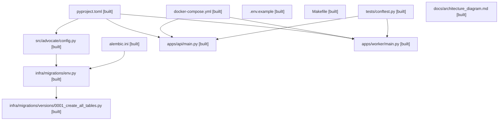

Phase note:

- `configs/settings.toml` was dropped in favour of `src/advocate/config.py` (pydantic-settings from env)
- Postgres exposed on host port 5433 (not 5432) to avoid conflict with a local Postgres instance
- Prefect upgraded from v2 to v3 to match the installed Python client
- App database is `advocate_app`; Prefect uses `advocate` to avoid `alembic_version` collision
- `dev-up` target auto-creates `advocate_app` if it does not exist

### Phase 1: Core Data Layer

Goal:

- establish append-only truth and provenance

Expected files:

- `infra/migrations/0001_core_tables.sql`
- `src/advocate/domain/models.py`
- `src/advocate/domain/versioning.py`
- `src/advocate/storage/db.py`
- `src/advocate/storage/repositories.py`
- `src/advocate/storage/provenance.py`
- `tests/integration/test_repositories.py`

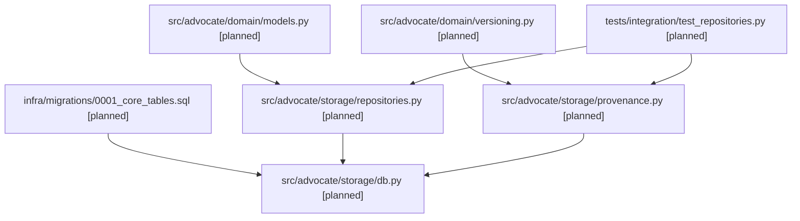

### Phase 2: Ingestion Service

Goal:

- accept evidence and persist it durably

Expected files:

- `apps/api/main.py`
- `src/advocate/ingestion/service.py`
- `src/advocate/ingestion/object_store.py`
- `src/advocate/ingestion/events.py`
- `tests/integration/test_evidence_ingestion.py`

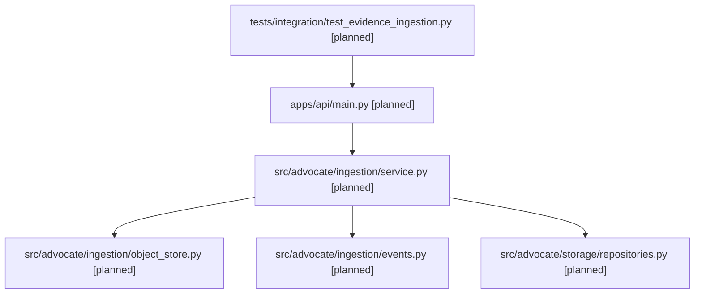

### Phase 3: Prefect Processing Flow

Goal:

- orchestrate deterministic per-case processing and open evaluation manifests

Expected files:

- `apps/worker/main.py`
- `src/advocate/processing/flows.py`
- `src/advocate/processing/locks.py`
- `src/advocate/processing/inspect.py`
- `src/advocate/storage/provenance.py`
- `tests/integration/test_process_case_event.py`

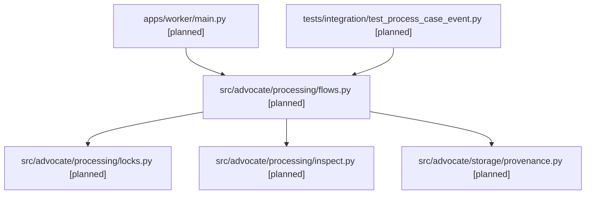

### Phase 4: Deterministic Merge And Case State

Goal:

- evaluate observations into versioned case truth

Expected files:

- `src/advocate/domain/requirements.py`
- `src/advocate/domain/observations.py`
- `src/advocate/domain/state_machine.py`
- `src/advocate/domain/merge.py`
- `tests/unit/test_state_machine.py`

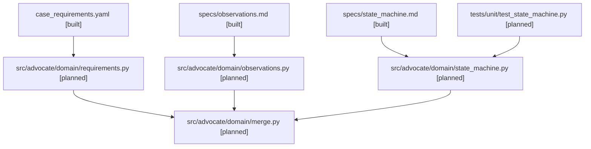

### Phase 5: OCR, Normalization, And Bounded LLM Extraction

Goal:

- turn raw documents and text into bounded, replayable observations

Expected files:

- `src/advocate/processing/ocr.py`
- `src/advocate/processing/normalize.py`
- `src/advocate/processing/extract.py`
- `src/advocate/processing/llm_contracts.py`
- `tests/unit/test_extraction_contracts.py`

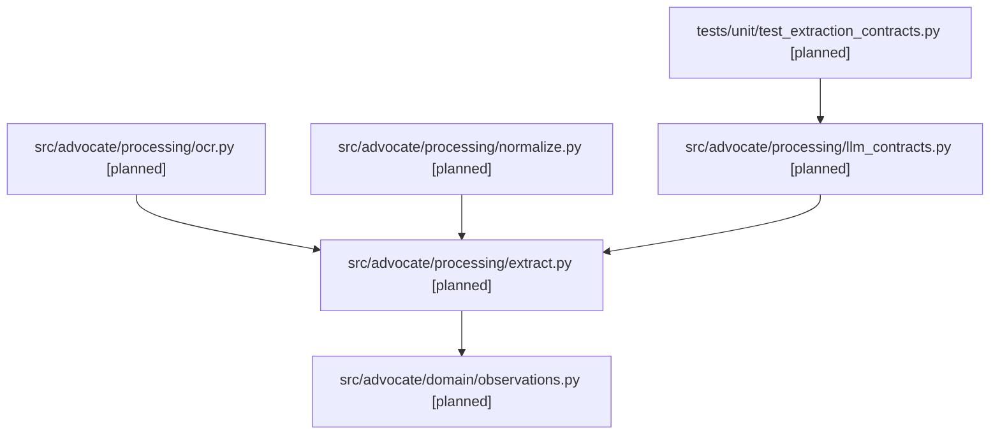

### Phase 6: Scoring, Hybrid Retrieval, And Next Best Action

Goal:

- score the case, retrieve supporting evidence, and produce ranked actions

Expected files:

- `src/advocate/scoring/scoring.py`
- `src/advocate/scoring/actions.py`
- `src/advocate/retrieval/chunking.py`
- `src/advocate/retrieval/index.py`
- `src/advocate/retrieval/search.py`
- `tests/unit/test_scoring.py`
- `tests/integration/test_retrieval_bundle.py`

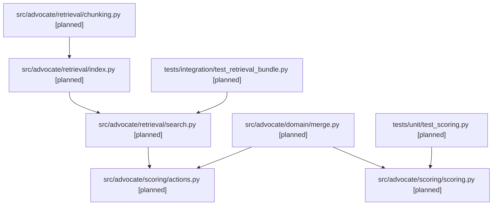

### Phase 7: Packet Rendering

Goal:

- render evidence-based outputs from a case version

Expected files:

- `src/advocate/rendering/packets.py`
- `src/advocate/rendering/citations.py`
- `src/advocate/rendering/templates.py`
- `tests/integration/test_packet_rendering.py`

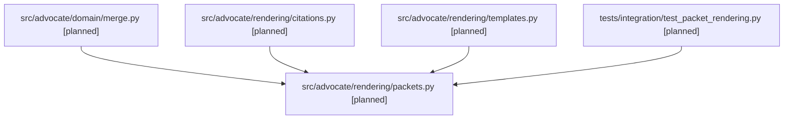

### Phase 8: UI

Goal:

- expose case state, actions, and packets through a human-readable interface

Expected files:

- `apps/ui/package.json`
- `apps/ui/src/main.tsx`
- `apps/ui/src/app.tsx`
- `apps/ui/src/routes/case.tsx`
- `apps/ui/src/components/case_timeline.tsx`
- `apps/ui/src/components/state_panel.tsx`
- `apps/ui/src/components/nba_panel.tsx`
- `apps/ui/src/components/packet_panel.tsx`
- `tests/integration/test_ui_case_flow.py`

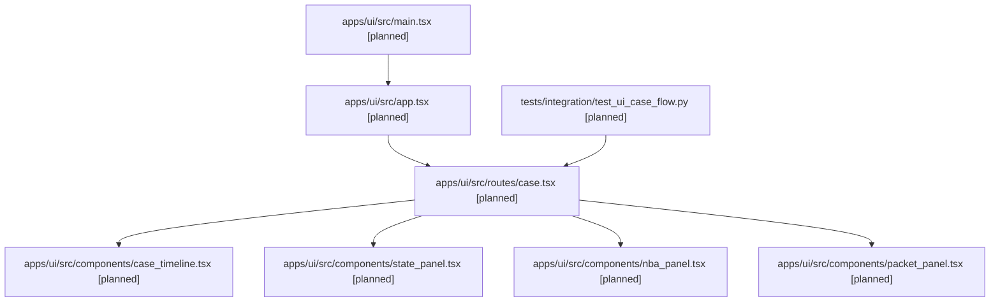

### Phase 9: Evaluation Harness

Goal:

- replay realistic scenarios against the whole system

Expected files:

- `src/advocate/evaluation/scenario_contract.py`
- `src/advocate/evaluation/scenario_runner.py`
- `tests/scenarios/test_minimal_scenario.py`

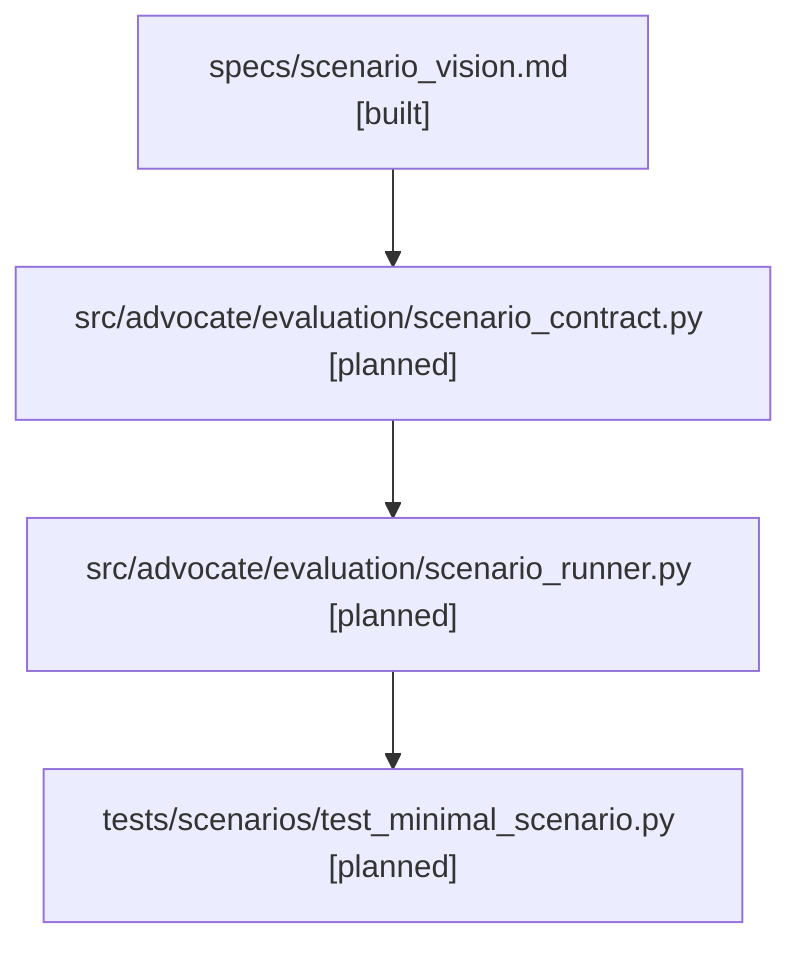

## 5. Phase Completion Checklist

Before marking a phase complete, update this document and confirm:

- the file list matches the actual repo
- each built file in the phase is marked `[built]`
- abandoned or renamed files are called out in a phase note
- the diagram still reflects the current architecture edges
